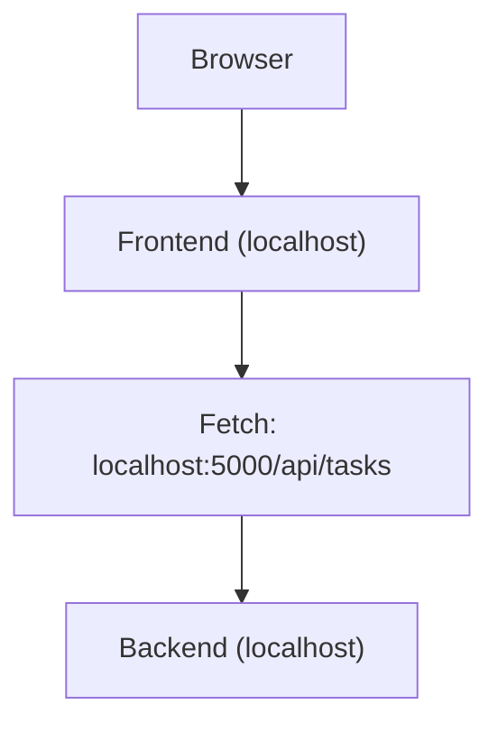
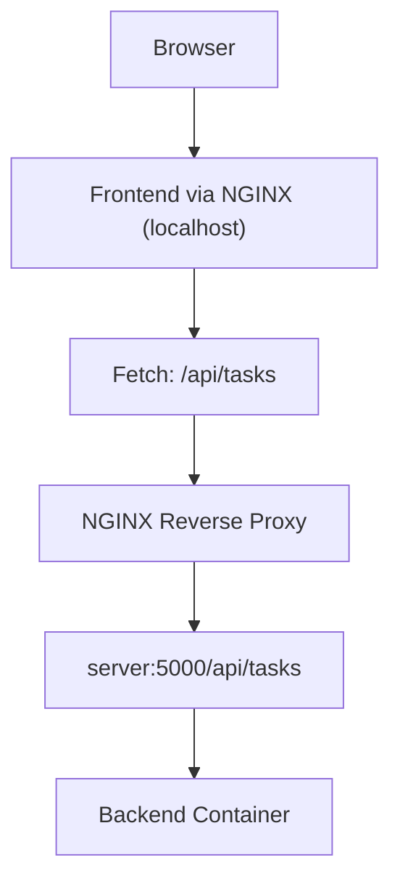

# 🚀 Troubleshooting API Requests in Dockerized Vite + Nginx Application

## Problem Overview

In a **Dockerized** application consisting of:

- **Frontend**: Built with **Vite** and served via **NGINX**
    
- **Backend**: Running as a **Node.js** server
    
- **Nginx**: Reverse proxy to handle API requests to the backend
    

We faced an issue where the API requests made from the frontend, after building with **Vite**, were not routing correctly when served through **NGINX**.

---

## Issues Faced

### 1. **Hardcoded API URL in the Vite Build**

- **Problem**: After building the Vite app, the API URL was **hardcoded** based on the `VITE_API_URL` environment variable in the `.env` file. However, when running the app via Docker and NGINX, it was still sending requests to `localhost` instead of the backend container's address (`server:5000`).
    
- **Cause**: When `VITE_API_URL` is specified in `.env`, Vite uses it during the build time. If the URL was `localhost`, this is what would be baked into the final build. But when served via Docker, the **localhost** inside the Nginx container refers to **the container's own localhost**, not the host machine.
    

### 2. **NGINX Not Routing the Requests**

- **Problem**: When the frontend was served via Nginx, the requests to `localhost/api/tasks` weren’t routed correctly to the backend. This caused **502 Bad Gateway** errors, as Nginx didn’t know how to forward these requests to the backend.
    
- **Cause**: The NGINX default configuration didn’t have the correct routing setup for `/api/tasks` to forward the request to the backend.
    

---

## Steps Taken to Fix the Issues

### Step 1: Fixing the Hardcoded API URL in the Vite Build

- **Initial Approach**: Vite uses environment variables like `VITE_API_URL` to set the API URL.
    
- We added the following to `.env`:
    
    ```bash
    VITE_API_URL=http://localhost:5000/api/tasks
    ```
    
- **Issue**: Even after specifying `localhost:5000`, NGINX was still trying to send requests to `localhost`, causing issues in Docker.
    

#### Solution:


#### ✅ Final Fix for API URL Handling in Dockerized Vite + NGINX App

Instead of hardcoding the full backend URL like `http://localhost:5000/api/tasks`, it's a **best practice** to use a **relative path** such as `/api/tasks` in the frontend when running inside Docker.

##### ✅ Final `API_URL` logic:

```js
const API_URL = import.meta.env.VITE_API_URL || 'http://localhost:5000/api/tasks';
```

This approach works in both **local development** and **Dockerized production** environments due to:

- Port mapping (`5000:5000`) in Docker Compose
    
- Internal container DNS resolution (e.g., `server:5000`)
    
- NGINX routing logic for `/api/tasks`
    

---

## ✅ Why it Works

### Case 1: Localhost (Development Mode)

When running locally (not in Docker), `VITE_API_URL` can be set as:

```
VITE_API_URL=http://localhost:5000/api/tasks
```

So, `fetch(API_URL)` hits the backend on the same host machine.

#### 🔁 Flow:



---

### Case 2: Dockerized App with NGINX and Internal Networking

When Dockerized, NGINX serves the frontend and also **proxies** `/api/tasks` requests to the backend via Docker's internal network.

So instead of using `http://localhost:5000`, we just use:

```js
const API_URL = '/api/tasks';
```

Nginx takes care of forwarding it internally.

#### 🔁 Flow:



---

## 🎯 Summary

- ✅ **`localhost:5000/api/tasks` works** in dev because of direct port exposure.
    
- ✅ **`/api/tasks` works** in Docker because NGINX and Docker's internal DNS resolve `server:5000`.
    
- ⚠️ Avoid hardcoding full URLs in production. Let **NGINX route** internally using **relative paths** like `/api/*`.
    

> 🔥 **Best Practice:**  
> Keep `VITE_API_URL` blank or set to a relative path (`/api/tasks`) for production. Use NGINX to route correctly inside the Docker network.

---

Let me know if you want a small table comparing both or if you'd like to convert this into a `README.md` for your GitHub repo!
---

### Step 2: Fixing NGINX Routing

- **Issue**: NGINX default configuration was not routing `/api/tasks` correctly.
    
- **Solution**: We wrote a custom `nginx.conf` to route requests:
    
    ```nginx
    worker_processes auto;
    
    events {
        worker_connections 1024;
    }
    
    http {
        include       mime.types;
        default_type  application/octet-stream;
    
        sendfile        on;
        keepalive_timeout  65;
    
        server {
            listen       80;
            server_name  localhost;
    
            location / {
                root   /usr/share/nginx/html;
                index  index.html;
                try_files $uri /index.html;
            }
    
            location /api/tasks {
                proxy_pass http://server:5000/api/tasks;
                proxy_set_header Host $host;
                proxy_set_header X-Real-IP $remote_addr;
                proxy_set_header X-Forwarded-For $proxy_add_x_forwarded_for;
                proxy_set_header X-Forwarded-Proto $scheme;
            }
    
            include /etc/nginx/default.d/*.conf;
        }
    
        include /etc/nginx/conf.d/*.conf;
    }
    ```
    
    - **Explanation**: The `/api/tasks` location block tells NGINX to proxy requests to the backend at `server:5000/api/tasks`, which matches our Docker Compose service name (`server`) and port `5000`.
        

---

### Step 3: Docker Compose Configuration

- **Initial Issue**: Docker Compose was correctly configured to run the services, but the request routing between containers wasn’t working as expected.
    

#### Fix:

- We ensured that the **backend server** was exposed on port `5000` in the Docker container so that requests from other containers (like NGINX) could reach it.
    
    ```yaml
    services:
      client:
        build:
          context: ./client
        ports:
          - 80:80
        depends_on:
          - server
        restart: unless-stopped
        environment:
          - API_URL=http://server:5000
    
      server:
        build:
          context: ./server
        environment:
          NODE_ENV: production
          MONGODB_URI: mongodb://mongo:27017/taskmanager
        ports:
          - 5000:5000
        depends_on:
          - mongo
        restart: unless-stopped
    ```
    
- **Explanation**: By exposing port `5000` from the `server` service, requests sent to `server:5000` would reach the backend container.
    

---

## Best Practices

### 1. **Use Relative Paths for API URLs in Docker**

- Avoid using hardcoded **absolute URLs** in the frontend for Dockerized applications. Use **relative paths** (e.g., `/api/tasks`), which will rely on NGINX or Docker’s internal network to route requests correctly.
    

### 2. **NGINX as a Reverse Proxy**

- **Use NGINX** to route requests to your backend from the frontend. This helps in decoupling the client from the backend’s internal URL.
    
- Write specific location blocks in NGINX configuration to handle routing of API requests (e.g., `/api/tasks`).
    

### 3. **Expose Services in Docker Compose**

- When using Docker Compose, **expose** backend ports correctly for inter-container communication (e.g., `5000:5000` for the backend). Docker Compose's internal network allows containers to reference each other by service names (e.g., `server:5000`).
    

### 4. **Environment Variables in Vite**

- Use **environment variables** (`import.meta.env.VITE_API_URL`) to configure the API URL dynamically depending on the environment. This allows you to easily switch between development, staging, and production environments.
    

### 5. **Default Configurations**

- Set sensible defaults in your app's code for the API URL to fall back to, such as using `http://localhost:5000` for local development when no environment variable is provided.
    

---

## Conclusion

This troubleshooting session allowed us to:

1. Understand how **Vite** hardcodes the environment variables during build time.
    
2. Resolve issues with **NGINX routing** by configuring a custom NGINX config to proxy requests to the backend.
    
3. Properly configure **Docker Compose** to ensure that containers could communicate and expose the necessary ports for proper routing.
    

By applying the solutions and best practices, we ensured that the **frontend and backend** in the Dockerized environment work seamlessly together.

---

Hope this helps others who face similar challenges. Feel free to raise any further issues, or pull request improvements! ✌🏼🚀

---
